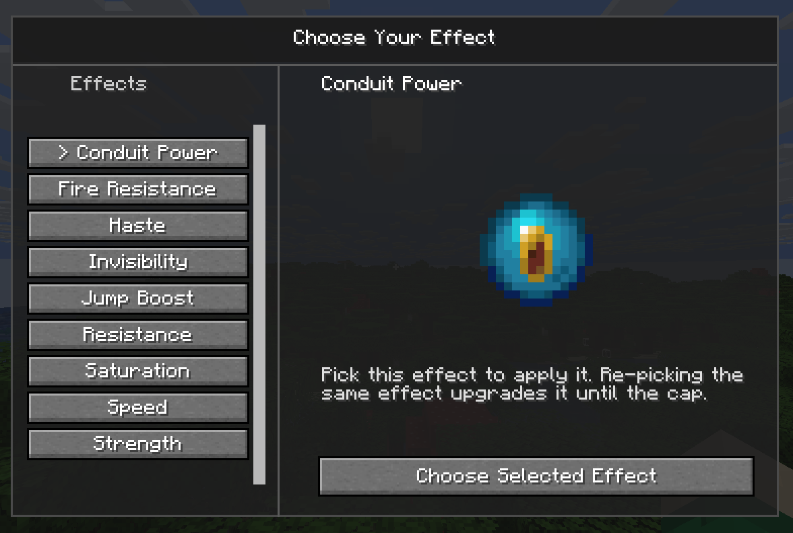
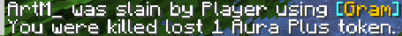
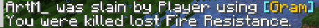

# AuraCraft

> A Fabric mod for Minecraft that gives players a persistent, token-based aura system — choose your status effects, upgrade them over time, and defend them in PvP.

---

## What is AuraCraft?

AuraCraft lets players permanently equip status effects as **auras** using a token economy. Instead of brewing potions, players spend tokens to lock in the effects they want and can upgrade those effects by reinvesting in the same one. Tokens and selections persist across sessions, making your aura a meaningful part of your character build.

On PvP servers, auras become a stake: dying to another player can cost you an effect or a token, and killers may be rewarded for it.

---
## Requirements

| Dependency | Version |
|---|---|
| Minecraft | `26.1.2` |
| Fabric Loader | `0.19.1+` |
| Fabric API | `0.145.4+26.1.2` |
| Java | `25+` |

---

## Installation

1. Install [Fabric Loader](https://fabricmc.net/use/installer/) for Minecraft `26.1.2`.
2. Download [Fabric API](https://modrinth.com/mod/fabric-api) and place it in your `mods/` folder.
3. Download the latest AuraCraft release and place it in your `mods/` folder.
4. Launch the game. A `config/auracraft.json` file will be generated on first run.

> **Note:** Both the server and all clients must have AuraCraft installed. The mod enforces a compatibility handshake on join.

---


## Gameplay


- Players use the picker UI (`Y` by default) to choose effects.
  
### The Token Economy
 
Every player starts with a token budget. The total **load** on your budget is always:
 
```
selected effects + available tokens ≤ maxEffects
```
 
This means holding tokens "costs" budget, spending them on effects is always the efficient play.
 
### Choosing and Upgrading Effects
 
- Press **Y** (default) to open the **Aura Picker**.
- Click an effect to select it. This consumes one token and activates the effect permanently.
- Click the **same effect again** to upgrade its amplifier (e.g. Speed I → Speed II). Each upgrade costs an additional token, up to the configured duplicate cap.
### Special Items
 
| Item | How to Obtain | Effect |
|---|---|---|
| `Aura Plus` | Crafting/Player drop | Restores your latest withdrawn effect first; otherwise restores first lost effect; otherwise grants +1 token |
| `Aura Reset` | Crafting | Clears all selected effects and returns repick tokens |
 
---

## PvP Rules


 
When you die to another player, AuraCraft applies the following logic (configurable):
 
- **Normal death:** Removes one of your selected effects based on `PvPEffectsLostOnDeath`.
- **Protected last effect:** If you have exactly 1 effect selected but still hold spare tokens, the death removes a token instead of your last effect.
- **No effects:** If you had no effects selected, a token drop can still occur when configured.
- **Killer reward:** The player who kills you may receive an `Aura Plus` drop, depending on server config.
---
 
## Commands
 
All commands require **GameMaster** (op level 2) unless noted.
 
| Command | Description |
|---|---|
| `/aura` | Toggles the AuraCraft UI on/off for yourself |
| `/aura status [player]` | Shows a player's current token count and selected effects |
| `/aura reset [player]` | Clears a player's selections and returns their repick tokens |
| `/aura plus [player] [amount]` | Grants the player extra tokens |
| `/aura remove [player] [amount]` | Removes tokens from a player |
| `/aura withdraw` | *(Any player)* Withdraws your latest selected effect into an `Aura Plus` item (or 1 token if no effects are selected) |
 
---
## Configuration
 
The config file is generated at `config/auracraft.json` on first launch. It can also be edited in-game via **Mod Menu**.
 
### General Settings
 
| Option | Default | Description |
|---|---|---|
| `PvPEffectsLostOnDeath` | `1` | How many effects are removed on a PvP death |
| `maxDuplicateAmplifierBonus` | `2` | Max times the same effect can be upgraded |
 
### Effects Settings
 
Each available effect has an individual toggle. Disabled effects are hidden entirely from the picker UI - useful for curating which effects are available on your server.
 
---
 
## Compatibility
 
AuraCraft performs a **version handshake** when a player joins a server. If the client and server have mismatched AuraCraft versions, the player will be disconnected with a descriptive message. Vanilla clients cannot join an AuraCraft server.
 
---
 
## License
 
MIT - see [LICENSE](LICENSE).
